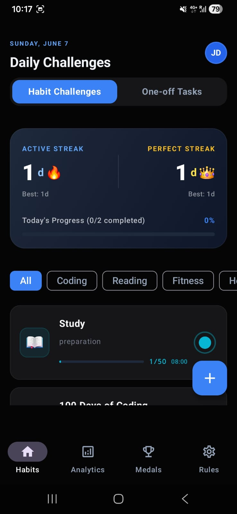
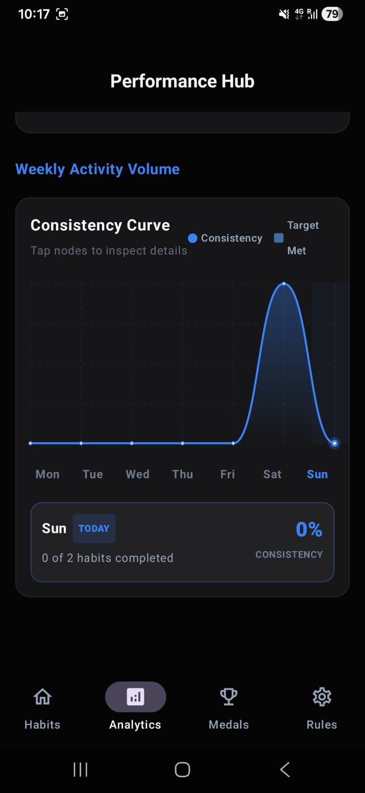
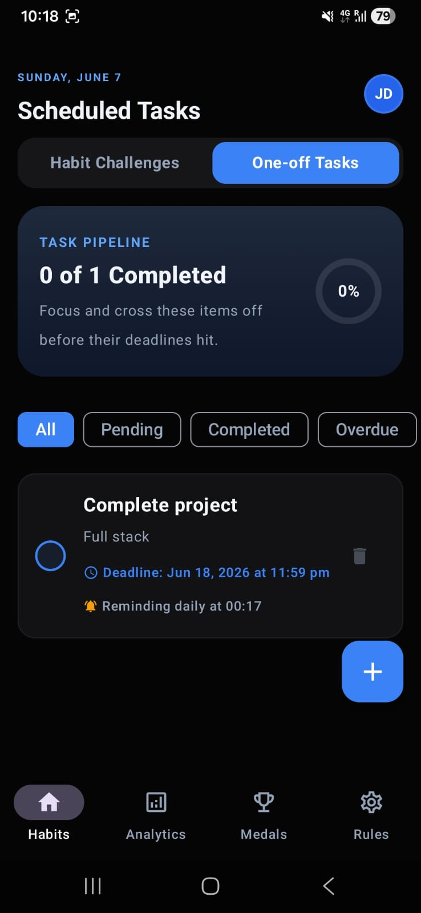
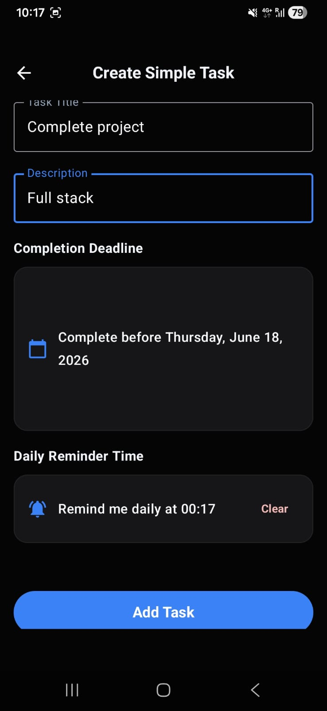
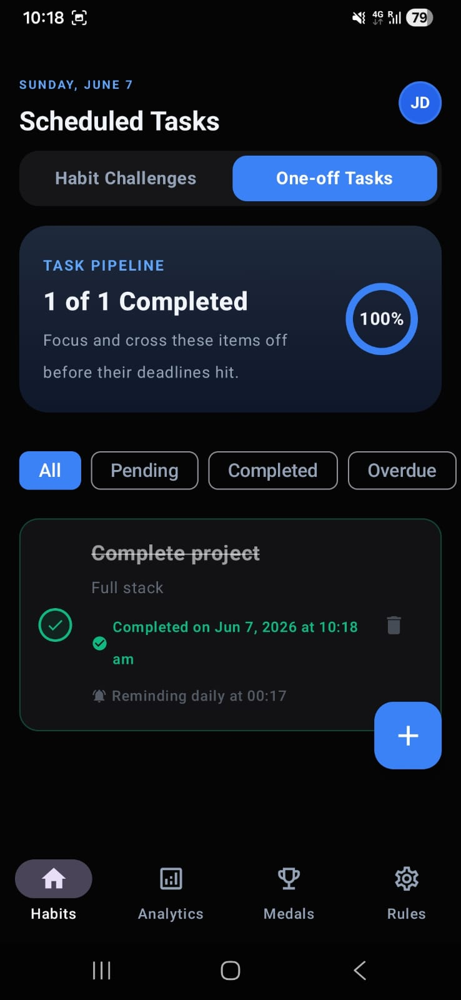
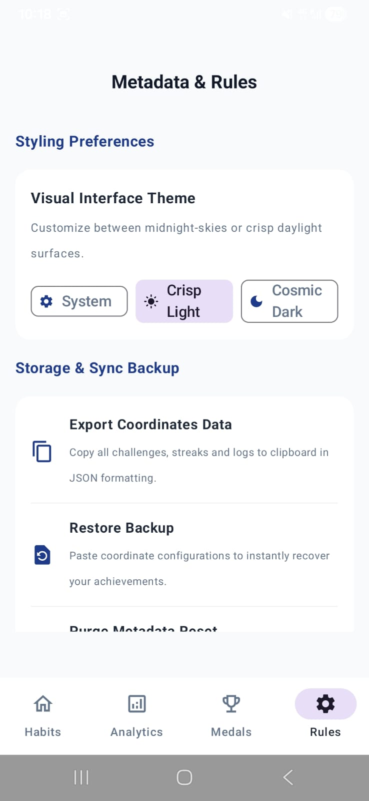

# HabitFlow — Persistent Habit & Streak Tracker

[](https://developer.android.com)
[](https://kotlinlang.org)
[](https://gradle.org)
[](https://developer.android.com/jetpack/compose)
[](LICENSE)

**HabitFlow** is a native, offline-first personal growth app for Android built with **Kotlin**, **Jetpack Compose**, and **Material Design 3**. It helps users build positive long-term habits through gamified streak tracking, interactive analytics, and a premium Dark Cosmic visual theme — all stored entirely on-device with zero cloud dependency.

---

## 📸 Screenshots

<table>
  <tr>
    <td align="center"><b>Daily Challenges</b></td>
    <td align="center"><b>Performance Hub</b></td>
    <td align="center"><b>One-off Tasks (Pending)</b></td>
  </tr>
  <tr>
    <td></td>
    <td></td>
    <td></td>
  </tr>
  <tr>
    <td align="center"><b>Create Simple Task</b></td>
    <td align="center"><b>One-off Tasks (Completed)</b></td>
    <td align="center"><b>Metadata & Rules</b></td>
  </tr>
  <tr>
    <td></td>
    <td></td>
    <td></td>
  </tr>
</table>

---

## ✨ Features

### 🔥 Streak Tracking
- **Active Streak** — increments any day at least one habit is completed
- **Perfect Streak 👑** — increments only on days *all* active habits are completed
- Historical best tracking for both streak types
- Live today's progress bar with completion ratio

### 📋 Habit Challenges
- Create recurring daily habits with categories: Coding, Reading, Fitness, Health, and more
- Per-habit progress counter (e.g. `1/50 08:00`) with subtask checklists
- Category-based filter tabs for fast navigation

### ✅ One-off Task Pipeline
- Create deadline-bound tasks with title, description, deadline date, and daily reminder time
- Tasks progress through states: Pending → Completed / Overdue
- Task Pipeline summary card with circular completion percentage indicator
- Filter tabs: All, Pending, Completed, Overdue

### 📊 Performance Hub (Analytics)
- Weekly **Consistency Curve** — a smooth cubic Bezier spline chart drawn via native Canvas `Path.cubicTo()`
- Area gradient fill beneath the spline
- Tappable day nodes with floating detail cards (habits completed, consistency %)
- Responsive layout via `BoxWithConstraints` for phones, foldables, and tablets

### 🎨 Visual Theme
- **Cosmic Dark** and **Crisp Light** themes, plus System Default
- Theme preference persisted instantly via `SharedPreferences` — zero flicker on cold start
- Deep space palette: electric blue `#60A5FA`, amber `#FBBF24`, midnight canvas `#0D111F`→`#07090E`
- Full edge-to-edge rendering with proper inset handling for status bar and nav gesture regions

### 🔔 Notifications
- Per-task and per-habit configurable daily reminder times
- Background `AlarmManager` scheduling with `BroadcastReceiver` for reliable delivery

### 💾 Data Export & Restore
- Export all challenges, streaks, and logs to clipboard as JSON
- Paste-to-restore for full data recovery on a new device

---

## 🏗️ Architecture

HabitFlow follows strict **MVVM** with a reactive Room → ViewModel → Compose pipeline.

```
┌────────────────────────────────────────────────────────┐
│                   Jetpack Compose UI                   │
│           (HomeScreen, AnalyticsScreen, etc.)          │
└───────────▲────────────────────────────────▲───────────┘
            │                                │ collectAsStateWithLifecycle
            │ Flow<List<T>>                  │
┌───────────┴────────────────────────────────┴───────────┐
│                    ChallengeViewModel                  │
│       Exposes unified StateFlow from Room Flows        │
└───────────▲────────────────────────────────────────────┘
            │
┌───────────┴────────────────────────────────────────────┐
│                    ChallengeRepository                 │
│         Queries local SQLite schemas via Room DAOs     │
└────────────┬───────────────┬───────────────────────────┘
             │               │
┌────────────▼──────┐ ┌──────▼──────────────┐ ┌──────────▼────────┐
│   ChallengeTable  │ │  CompletionRecord   │ │    TaskTable      │
│ (Active/Archived) │ │  (yyyy-MM-dd logs)  │ │ (Subtask checklist)│
└───────────────────┘ └─────────────────────┘ └───────────────────┘
```

### Room ORM (SQLite)
All habits, completion logs, and subtasks are stored in a local SQLite database via Room.

| Entity | Purpose |
|---|---|
| `Challenge` | Core habit — title, category, icon, recurrence schedule |
| `CompletionRecord` | Daily completion log keyed by `challengeId` + `yyyy-MM-dd` |
| `Task` | One-off task with deadline, reminder time, and completion timestamp |

Database interfaces return reactive `Flow<List<T>>` — the UI re-renders automatically on any write.

### ViewModel State
`ChallengeViewModel` combines active challenges and completion records using Kotlin `combine` and exposes a single `StateFlow` via `.stateIn(scope, SharingStarted.WhileSubscribed(5000), default)`.

### SharedPreferences
Theme selection (Cosmic Dark / Crisp Light / System) is written to `SharedPreferences` so it is available before the first Compose frame — eliminating any cold-start theme flicker.

---

## 📂 Project Structure

```
/
├── app/
│   ├── src/
│   │   ├── main/
│   │   │   ├── java/com/example/
│   │   │   │   ├── MainActivity.kt
│   │   │   │   ├── data/
│   │   │   │   │   ├── database/AppDatabase.kt
│   │   │   │   │   ├── model/                     # Challenge, CompletionRecord, Task
│   │   │   │   │   └── repository/
│   │   │   │   ├── notification/                  # AlarmManager + BroadcastReceiver
│   │   │   │   ├── ui/
│   │   │   │   │   ├── screens/                   # HomeScreen, AnalyticsScreen, MedalsScreen, RulesScreen
│   │   │   │   │   ├── theme/                     # Color, Typography, Shape, Theme
│   │   │   │   │   └── viewmodel/ChallengeViewModel.kt
│   │   │   │   └── utils/
│   │   │   │       └── ChallengeStats.kt          # StatsEngine — streak & analytics logic
│   │   │   └── res/
│   │   │       ├── drawable/
│   │   │       ├── mipmap-anydpi-v26/             # Adaptive launcher icon
│   │   │       └── values/strings.xml
│   │   └── test/java/com/example/
│   │       ├── ExampleUnitTest.kt
│   │       ├── ExampleRobolectricTest.kt
│   │       └── GreetingScreenshotTest.kt
└── build.gradle.kts
```

---

## 🛠️ Setup & Build

### Prerequisites
- **Android Studio** Koala (2024.1) or newer
- **JDK 17**
- Android Emulator or physical device with USB debugging enabled (API 26+)

### Clone
```bash
git clone https://github.com/AdityaKarippadathUdai/Daily-Streak-Tracker.git
cd Daily-Streak-Tracker
```

### Compile Kotlin Sources
```bash
./gradlew compileDebugKotlin
```

### Build Debug APK
```bash
./gradlew assembleDebug
```
Output: `app/build/outputs/apk/debug/app-debug.apk`

### Install on Connected Device
```bash
./gradlew installDebug
```

### Run Unit Tests
```bash
./gradlew :app:testDebugUnitTest
```

---

## 🧪 Testing

| Test File | Scope |
|---|---|
| `ExampleUnitTest.kt` | Pure JVM — date formatting, streak calculations, string utilities |
| `ExampleRobolectricTest.kt` | Android context simulation — `SharedPreferences`, Activity lifecycle, Room queries |
| `GreetingScreenshotTest.kt` | Roborazzi visual regression — Compose layout snapshot comparison |

---

## 🛣️ Roadmap

- [ ] Widgets (Glance API) for home-screen streak display
- [ ] CSV export in addition to JSON
- [ ] Cloud sync via Firebase (opt-in)
- [ ] Habit templates library
- [ ] Weekly review summary notification

---

## 📄 License

This project is licensed under the MIT License — see the [LICENSE](LICENSE) file for details.
